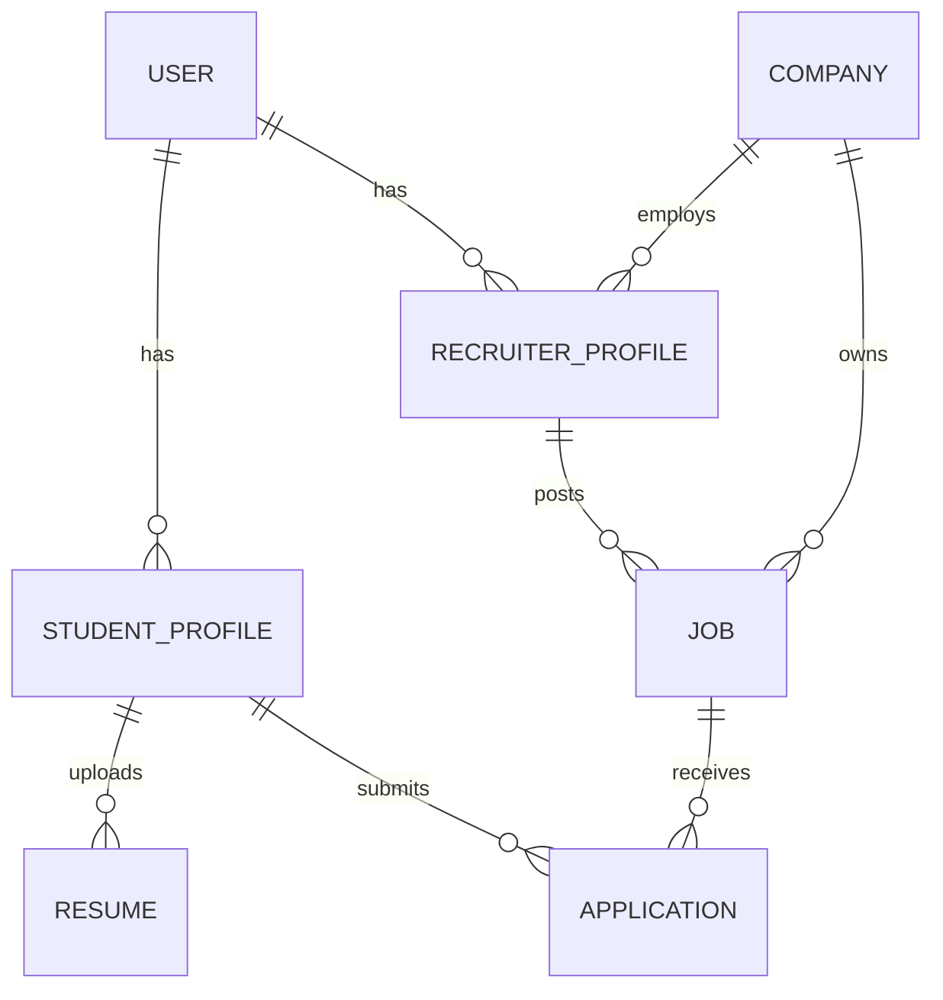
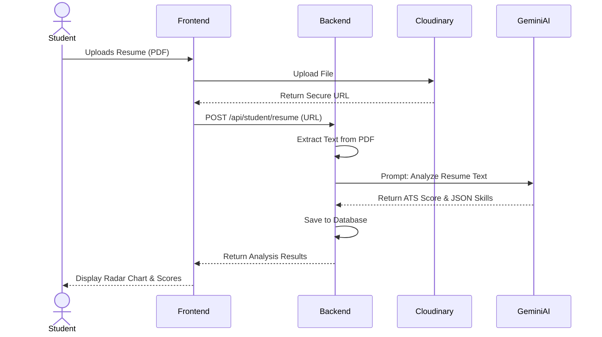

# System Diagrams

## 1. ER Diagram



## 2. Sequence Diagram: AI Resume Analysis



## 3. Use Case Diagram

```mermaid
usecaseDiagram
    actor Student
    actor Recruiter
    actor Admin
    
    Student --> (Upload Resume)
    Student --> (Take AI Interview)
    Student --> (Apply to Jobs)
    
    Recruiter --> (Post Jobs)
    Recruiter --> (Review Candidates)
    
    Admin --> (Verify Companies)
    Admin --> (Manage Users)
```
